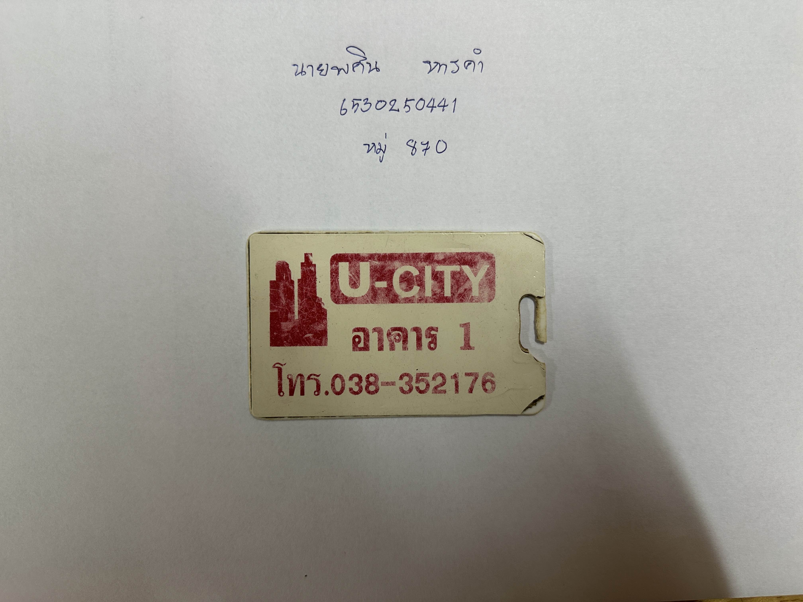

# 🔒 ***Security Controls*** 🔒
  
## 🏠 Key Card Dormitory 🏠

### 💾 Control Function 💾  
✅ **Preventive** – ป้องกันการเข้าถึงโดยไม่ได้รับอนุญาต  

### 🔹 Types of Security Control 🔹  
- 🛠 **Technical Control** – เป็นใช้เทคโนโลยีอิเล็กทรอนิกส์ที่ใช้สำหรับในการยืนยันตัวตน
- 🚪 **Physical Control** – เป็นจำกัดการเข้าถึงโดยใช้ระบบกุญแจอิเล็กทรอนิกส์

 

  ### 📌 สรุป
  
🔑 **คีย์การ์ด เข้าหอ** เป็นระบบควบคุมการเข้าถึง (**Access Control**) สำหรับใช้เข้าออกอาคารของ ช่วยจำกัดการเข้าใช้พื้นที่เฉพาะ **ผู้ที่ได้รับอนุญาต** เท่านั้น
เพิ่มความปลอดภัยให้กับผู้อยู่อาศัยโดย **ป้องกันบุคคลภายนอกเข้าถึงโดยไม่ได้รับอนุญาต** ใช้เทคโนโลยีอิเล็กทรอนิกส์ในการยืนยันตัวตน (**Technical Control**) และทำหน้าที่เป็นกุญแจอิเล็กทรอนิกส์ปิดกั้นทางเข้าออก (**Physical Control**) 🔐

  

